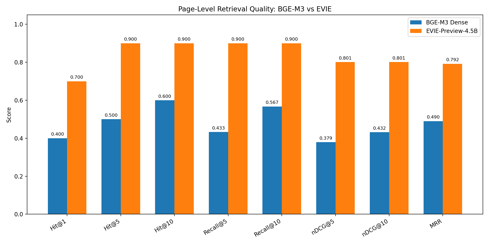

# PageRAG: EVIE vs BGE-M3 for Financial PDF Retrieval

This project compares two approaches to page-level document retrieval:

- **BGE-M3** — dense retrieval over extracted page text
- **EVIE-Preview-4.5B** — visual multi-vector retrieval directly over page images

The benchmark uses financial documents from the ViDoRe V3 Finance English dataset.

The goal is simple: given a question about a long financial document, how reliably can each approach find the page that contains the answer?

## Why this matters

Document RAG systems depend on retrieval before an LLM can answer anything.

For PDFs with tables, financial statements, complex layouts, charts, or imperfect text extraction, converting a page to plain text can discard useful visual information. Visual document retrievers take a different approach by embedding the page itself.

This repository measures that trade-off on a small controlled benchmark.

## Experiment

Dataset:

`vidore/vidore_v3_finance_en`

Evaluation setup:

- First 100 document pages used as the candidate corpus
- 10 queries with at least one relevant page inside that corpus
- Same candidate pages and relevance judgments used for both models
- Page-level retrieval
- Graded ViDoRe relevance judgments used for nDCG

This is a **100-page sampled-corpus experiment**, not an official full ViDoRe leaderboard result.

## Results



| Metric | BGE-M3 Dense | EVIE-Preview-4.5B |
|---|---:|---:|
| Hit@1 | 0.400 | **0.700** |
| Hit@5 | 0.500 | **0.900** |
| Hit@10 | 0.600 | **0.900** |
| Recall@5 | 0.433 | **0.900** |
| Recall@10 | 0.567 | **0.900** |
| nDCG@5 | 0.379 | **0.801** |
| nDCG@10 | 0.432 | **0.801** |
| MRR | 0.490 | **0.792** |
| Embedding index size | **0.39 MB** | 18.43 MB |

In this sample, EVIE produced better retrieval quality across every measured ranking metric.

The trade-off is index size: EVIE's multi-vector visual representation used substantially more storage than BGE-M3's single-vector dense embeddings.

## Example

Query:

> Did JPMorganChase execute more than half of its planned $30 billion stock repurchase program by year-end?

Ground-truth page:

- Corpus ID: `10`
- Document: `jpmorgan_chase_2024`
- PDF page: `107`

Results across 100 candidate pages:

| Model | Rank of relevant page |
|---|---:|
| BGE-M3 | 17 |
| EVIE-Preview-4.5B | **1** |

For this query, BGE-M3 did not return the relevant page in its top 10, while EVIE ranked it first.

## Retrieval pipelines

### BGE-M3

```text
PDF page
   ↓
ViDoRe markdown text
   ↓
BGE-M3
   ↓
1024-dimensional dense embedding
   ↓
Dot-product similarity

```

### EVIE

```text
PDF page image
   ↓
EVIE-Preview-4.5B
   ↓
Multi-vector visual representation
   ↓
Late-interaction scoring
```

The BGE-M3 baseline uses markdown text supplied by ViDoRe. It is therefore a text-retrieval baseline, not an OCR benchmark.


## Runtime environment

Both models were evaluated on a Google Colab NVIDIA Tesla T4 for the controlled runtime comparison.

| Model | Avg. query latency | Indexing time | Index size |
|---|---:|---:|---:|
| BGE-M3 | 0.0267 s | 27.04 s | 0.39 MB |
| EVIE-Preview-4.5B | 1.0189 s | Not recorded | 18.43 MB |

BGE-M3 reproduced the same retrieval-quality metrics on the T4 as the original local baseline.

In this implementation, BGE-M3 had substantially lower measured query latency. However, the EVIE retrieval loop is not optimized in the same way: page representations were stored on CPU and scored sequentially with CPU-to-GPU transfers. The latency numbers should therefore be treated as measured implementation performance rather than a definitive model-speed comparison.

EVIE's 100-page indexing time was not recorded and is intentionally left unestimated.


## Repository structure

```text
pagerag-evie-benchmark/
├── notebooks/
│   └── evie_vidore_finance_benchmark.ipynb
├── results/
│   ├── benchmark_summary.csv
│   ├── bge_m3_10query_results.csv
│   ├── evie_10query_results.csv
│   ├── single_query_comparison.csv
│   └── single_query_comparison.md
├── src/
│   ├── data/
│   ├── evaluate_baseline.py
│   ├── search_sample.py
│   ├── test_bge.py
│   └── test_similarity.py
├── .gitignore
├── requirements.txt
└── README.md
```

## Reproducing the results

Per-query benchmark outputs are stored in:

- `results/bge_m3_10query_results.csv`
- `results/evie_10query_results.csv`

Aggregate metrics are stored in:

- `results/benchmark_summary.csv`

The EVIE Colab workflow is available in:

- `notebooks/evie_vidore_finance_benchmark.ipynb`

## Limitations

This is an initial experiment using 10 queries and a 100-page candidate corpus from one English financial dataset.

The current text baseline uses ViDoRe-provided markdown rather than OCR output. Both runtime measurements now use a Tesla T4, but the BGE-M3 and EVIE retrieval implementations are not equally optimized.

The results should therefore be treated as evidence from this sampled benchmark, not as a general claim that EVIE will outperform BGE-M3 on every document collection.

## Next steps

- Run both models on the same GPU for a controlled performance comparison
- Add an OCR-based baseline for scanned PDFs
- Test degraded pages with blur, downsampling, noise, and rotation
- Extend the benchmark to multilingual documents
- Scale the candidate corpus beyond 100 pages
